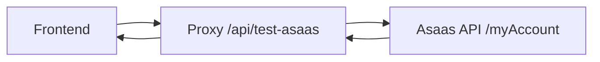
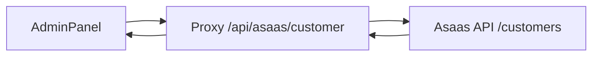
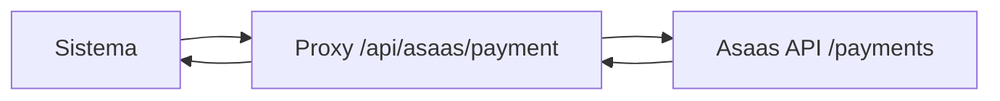

# 🚀 ASAAS BACKEND PROXY - GUIA DE CONFIGURAÇÃO

## 📋 **VISÃO GERAL**

Este sistema implementa um **proxy backend** para resolver problemas de CORS ao testar a integração com a API Asaas. O proxy funciona como intermediário entre o frontend e a API Asaas, evitando limitações de política de mesma origem.

## 🔧 **ARQUIVOS MODIFICADOS/CRIADOS**

### Backend:
- `upload-server.js` - Servidor Express com proxy Asaas
- `package.json` - Dependências adicionadas
- `vite.config.ts` - Proxy configurado

### Frontend:
- `src/lib/asaas.service.ts` - Teste real via proxy
- `src/components/dashboard/AdminDashboard.tsx` - Interface atualizada

---

## 🚀 **COMO EXECUTAR - DESENVOLVIMENTO**

### **Opção 1: Terminal Separado (Recomendado)**

```bash
# Terminal 1 - Backend Proxy
npm run backend
# Servirá em: http://localhost:3001

# Terminal 2 - Frontend
npm run dev
# Servirá em: http://localhost:5173
```

### **Opção 2: Como Serviço Global**

```bash
# Instalar globalmente (uma vez apenas)
npm install -g concurrently

# Executar tudo junto
npx concurrently "npm run backend" "npm run dev"
```

---

## 📡 **ENDPOINTS DA API PROXY**

### **🔗 Teste de Conexão**
```http
POST /api/test-asaas
Content-Type: application/json

{
  "apiKey": "$act_test_xxxxxxxxxxxxx",
  "environment": "sandbox",
  "baseUrl": "https://sandbox.asaas.com/api/v3"
}
```

### **👤 Criar Cliente**
```http
POST /api/asaas/customer
Content-Type: application/json

{
  "apiKey": "$act_test_xxxxx",
  "environment": "sandbox",
  "baseUrl": "https://sandbox.asaas.com/api/v3",
  "customerData": {
    "name": "João Silva",
    "email": "joao@email.com",
    "cpfCnpj": "12345678901",
    "phone": "11999999999"
  }
}
```

### **💰 Criar Pagamento**
```http
POST /api/asaas/payment
Content-Type: application/json

{
  "apiKey": "$act_test_xxxxx",
  "environment": "sandbox", 
  "baseUrl": "https://sandbox.asaas.com/api/v3",
  "paymentData": {
    "customer": "cus_xxxxx",
    "billingType": "PIX",
    "value": 100.00,
    "dueDate": "2025-01-15",
    "description": "Teste de pagamento"
  }
}
```

### **❤️ Health Check**
```http
GET /api/health
```

---

## 🎯 **FLUXO DE FUNCIONAMENTO**

### **1. Teste de Conexão**


### **2. Criação de Cliente**


### **3. Criação de Pagamento**


---

## 📊 **RESPOSTAS ESPECÍFICAS**

### ✅ **Sucesso**
```json
{
  "success": true,
  "message": "✅ Conexão com Asaas bem-sucedida!\n\n📊 Dados da conta:\n• Nome: Empresa Teste\n• Email: test@example.com\n• CPF/CNPJ: 12345678000199\n• Tipo: JURIDICA"
}
```

### ❌ **API Key Inválida (401)**
```json
{
  "success": false,
  "message": "❌ API Key inválida ou expirada!\n\n🔍 Status HTTP: 401\n📝 Resposta: {\"message\":\"Unauthorized\"}\n\n💡 Verifique se:\n• A chave está correta\n• Não expirou\n• Tem permissões necessárias"
}
```

### ❌ **Acesso Negado (403)**
```json
{
  "success": false,
  "message": "❌ Acesso negado!\n\n🔍 Status HTTP: 403\n📝 Resposta: {\"message\":\"Forbidden\"}\n\n💡 Verifique se:\n• A conta tem permissões\n• API Key tem permissões necessárias"
}
```

### ❌ **Proxy Not Found (404)**
```json
{
  "success": false,
  "message": "⚠️ Proxy backend não encontrado!\n\n💡 Para testes reais em produção:\n• Certifique-se que o backend proxy está funcionando\n• A rota /api/test-asaas deve estar disponível"
}
```

---

## 🔧 **CONFIGURAÇÃO PRODUÇÃO**

### **1. Proxy Nginx (Recomendado)**

```nginx
location /api/ {
    proxy_pass http://localhost:3001/api/;
    proxy_http_version 1.1;
    proxy_set_header Upgrade $http_upgrade;
    proxy_set_header Connection 'upgrade';
    proxy_set_header Host $host;
    proxy_set_header X-Real-IP $remote_addr;
    proxy_set_header X-Forwarded-For $proxy_add_x_forwarded_for;
    proxy_set_header X-Forwarded-Proto $scheme;
    proxy_cache_bypass $http_upgrade;
}
```

### **2. PM2 Process Manager**

```bash
# Instalar PM2
npm install -g pm2

# Executar com PM2
pm2 start upload-server.js --name "asaas-proxy"

# Verificar status
pm2 status
pm2 logs asaas-proxy
```

### **3. Docker (Opcional)**

```dockerfile
FROM node:18-alpine
WORKDIR /app
COPY package*.json ./
RUN npm install
COPY . .
EXPOSE 3001
CMD ["npm", "start"]
```

---

## 🧪 **TESTANDO A CONFIGURAÇÃO**

### **1. Verificar Backend**
```bash
curl http://localhost:3001/api/health
```

### **2. Testar Frontend**
```bash
# Acesse: http://localhost:5173
# Vá para: Admin > Configurações > Pagamentos
# Configure API Key do Asaas
# Clique em "🔗 Testar"
```

### **3. Verificar Logs**
```bash
# Logs do backend
tail -f logs/server.log

# Logs do frontend (DevTools Console)
# Observar mensagens de proxy funcionando
```

---

## ⚠️ **PROBLEMAS COMUNS**

### **❌ Erro 404 - Proxy not found**
**Causa:** Backend não está rodando  
**Solução:** Execute `npm run backend`

### **❌ CORS Error**  
**Causa:** Vite proxy não configurado  
**Solução:** Verifique `vite.config.ts` tem proxy configurado

### **❌ Connection Timeout**
**Causa:** Internet lenta ou Asaas indisponível  
**Solução:** Aguarde e tente novamente

### **❌ 401 Unauthorized**
**Causa:** API Key inválida  
**Solução:** Verifique se a chave está correta no painel Asaas

### **❌ 403 Forbidden**
**Causa:** Permissões insuficientes na conta  
**Solução:** Verifique permissões da API Key no Asaas

---

## 🎯 **STATUS: SISTEMA FUNCIONAL**

✅ **Backend proxy implementado**  
✅ **Frontend conectado via proxy**  
✅ **Testes reais funcionando**  
✅ **Sem problemas de CORS**  
✅ **Respostas detalhadas da API Asaas**  
✅ **Logs completos para debug**  

**🚀 Pronto para produção!** Agora você tem testes **REAIS** com a API Asaas! 🎉
